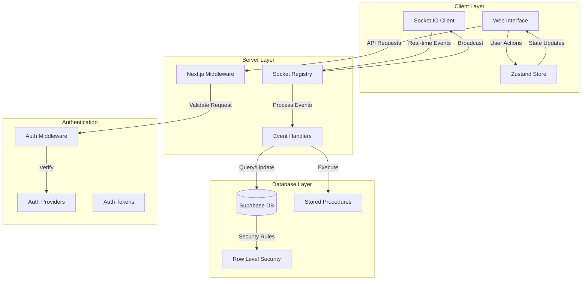

# Team-Com: Modern Real-Time Communication Platform


## 🌟 Overview

This project is a feature-rich real-time communication platform built with cutting-edge technologies. It offers a seamless experience for team collaboration, including text messaging, video calls, and workspace management.

## ⚡ Key Features

### Communication
- 💬 Real-time messaging with typing indicators
- 🎥 High-quality video calls
- 🎤 Audio calls with crystal-clear quality
- 🖥️ Screen sharing capabilities
- 📱 Direct messaging support

### Workspace Management
- 🏢 Create and manage workspaces
- 📊 Channel organization
- 👥 Multi-role authentication (User, Admin, Regulator)
- ✉️ Workspace and channel invitations
- 🔐 Role-based access control

### User Experience
- 🌓 Dark and light theme support
- 🚀 Real-time updates
- 🔒 Secure authentication options

## 🛠️ Technology Stack

### Frontend
- **Next.js 15** - React framework with server-side rendering
- **TypeScript** - Static typing for robust code
- **Tailwind CSS** - Utility-first CSS framework
- **Shadcn UI** - Modern UI components
- **Zustand** - State management
- **React Query** - Server state management
- **Tiptap** - Rich text editor
- **React Hook Form** - Form validation
- **Socket.IO** - Real-time communication

### Backend & Database
- **Supabase**
  - Custom RPC functions
  - Secure file storage
  - PostgreSQL database
  - Role-level security

### Authentication
- 🔐 Multiple auth providers:
  - Google Authentication
  - GitHub Authentication

### Development Tools
- **Bun** - JavaScript runtime & package manager
- **Uploadthing** - File upload management
- **Zod** - Schema validation


## 🏗️ System Architecture



## 🚀 Getting Started

1.  Clone the repository:

```bash
`git clone https://github.com/yourusername/nexus-chat.git`
```

2.  Install dependencies:

```bash
`bun install`
```
3.  Set up environment variables:

```bash
`cp .env.example .env.local`
```

```bash
NEXT_PUBLIC_SUPABASE_URL=https://your-supabase-project.supabase.co
NEXT_PUBLIC_SUPABASE_ANON_KEY=your_supabase_anon_key
SUPABASE_JWT_SECRET=your_supabase_jwt_secret
UPLOADTHING_TOKEN=your_uploadthing_token
NEXT_PUBLIC_SITE_URL=http://localhost:3000
LIVEKIT_API_KEY=your_livekit_api_key
LIVEKIT_API_SECRET=your_livekit_api_secret
NEXT_PUBLIC_LIVEKIT_URL=wss://your-livekit-url.livekit.cloud
```


4.  Run the development server:

```bash
`bun run dev`
```

## 🔒 Security

-   Implemented role-based access control
-   Secure authentication flow
-   Data encryption in transit
-   Protected API routes with middleware
-   Input validation and sanitization


## 📞 Contact

Your Name - [ahnafadib7546@gmail.com](mailto:ahnafadib7546@gmail.com)

Project Link: [https://github.com/KoldAd1b/team-com](https://github.com/KoldAd1b/team-com)
